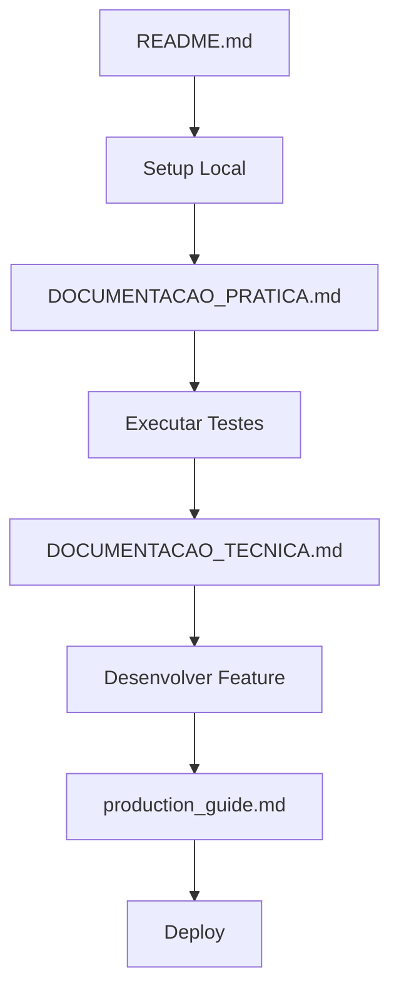
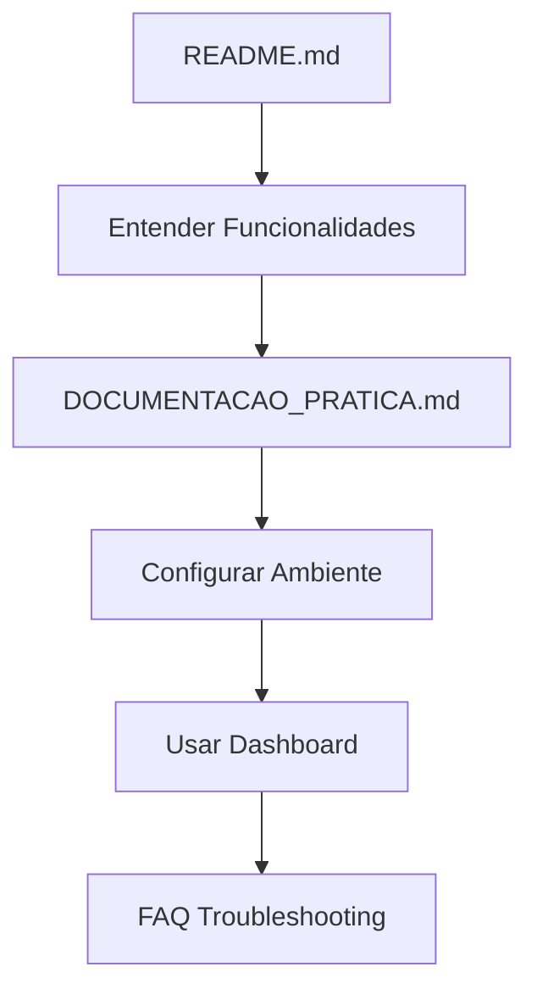
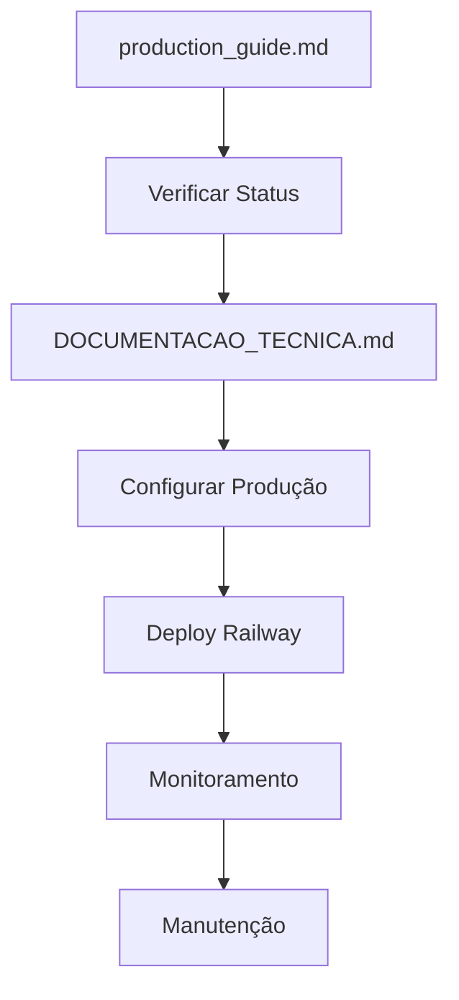

# ÍNDICE DA DOCUMENTAÇÃO - CVCRM ETL

## Visão Geral do Projeto

O **CVCRM ETL** é um sistema completo de sincronização de dados entre a API CVCRM e um data warehouse PostgreSQL, com dashboard web integrado. O sistema foi desenvolvido para deploy 100% gratuito usando Railway + Neon PostgreSQL.

**Status Atual - Agosto 2025**: Sistema corrigido e alinhado com a estrutura real CVDW.

## Estrutura da Documentação

### 📚 Documentação Completa

#### 1. [README.md](README.md) - Visão Geral e Quick Start
- **Público**: Desenvolvedores, usuários finais
- **Conteúdo**: 
  - Características do sistema
  - Arquitetura geral
  - Configuração rápida
  - Deploy no Railway
  - Funcionalidades principais
  - Troubleshooting básico

#### 2. [DOCUMENTACAO_TECNICA.md](DOCUMENTACAO_TECNICA.md) - Documentação Técnica Avançada
- **Público**: Arquitetos, desenvolvedores senior, DevOps
- **Conteúdo**:
  - Arquitetura detalhada do sistema
  - Estrutura completa do banco de dados
  - Schemas SQL de todas as tabelas e views
  - APIs e endpoints da CVDW
  - Configurações de deploy e produção
  - Otimizações de performance
  - Monitoramento e observability
  - Troubleshooting técnico avançado
  - Estratégias de testing
  - Configurações de segurança

#### 3. [DOCUMENTACAO_PRATICA.md](DOCUMENTACAO_PRATICA.md) - Guia Prático de Uso
- **Público**: Usuários finais, operadores, analistas
- **Conteúdo**:
  - Comandos essenciais para operação diária
  - Guias passo-a-passo para configuração
  - Interpretação de dados e KPIs
  - Solução de problemas comuns
  - Checklists de manutenção
  - Casos de uso práticos
  - Integração com ferramentas BI
  - FAQ completo

#### 4. [production_guide.md](prodution_guide.md) - Guia de Produção e Protocolo
- **Público**: DevOps, gestores de projeto
- **Conteúdo**:
  - Status atual do projeto
  - Protocolo de limpeza e validação
  - Estrutura final de arquivos
  - Comandos de produção
  - Arquitetura resumida
  - Procedimentos de manutenção

#### 5. [CLAUDE.md](CLAUDE.md) - Contexto de Desenvolvimento
- **Público**: Desenvolvedores, Claude AI
- **Conteúdo**:
  - Histórico do projeto
  - Decisões técnicas tomadas
  - Correções implementadas
  - Configurações específicas
  - Contexto para desenvolvimento futuro

### 🛠️ Arquivos de Configuração

#### Segurança e Deploy
- **[.gitignore](.gitignore)**: Proteção de credenciais e compliance LGPD
- **[.env.example](.env.example)**: Template seguro para variáveis de ambiente
- **[Procfile](Procfile)**: Configuração de processos Railway
- **[runtime.txt](runtime.txt)**: Versão Python específica
- **[railway.json](railway.json)**: Configuração de deploy Railway

#### Dependências
- **[requirements.txt](requirements.txt)**: Dependências Python validadas

### 🎯 Por Onde Começar?

#### Para Desenvolvedores Novos no Projeto
1. **[README.md](README.md)** - Entenda o projeto e faça o setup inicial
2. **[DOCUMENTACAO_PRATICA.md](DOCUMENTACAO_PRATICA.md)** - Aprenda os comandos básicos
3. **[DOCUMENTACAO_TECNICA.md](DOCUMENTACAO_TECNICA.md)** - Aprofunde-se na arquitetura

#### Para Usuários Finais
1. **[README.md](README.md)** - Visão geral das funcionalidades
2. **[DOCUMENTACAO_PRATICA.md](DOCUMENTACAO_PRATICA.md)** - Guia completo de uso

#### Para DevOps e Deploy
1. **[production_guide.md](prodution_guide.md)** - Protocolo e status atual
2. **[DOCUMENTACAO_TECNICA.md](DOCUMENTACAO_TECNICA.md)** - Configurações de produção
3. **[.env.example](.env.example)** - Template de variáveis

#### Para Troubleshooting
1. **[DOCUMENTACAO_PRATICA.md](DOCUMENTACAO_PRATICA.md)** - Problemas comuns
2. **[DOCUMENTACAO_TECNICA.md](DOCUMENTACAO_TECNICA.md)** - Troubleshooting avançado
3. **[production_guide.md](prodution_guide.md)** - Problemas conhecidos

## Fluxo de Trabalho por Perfil

### 👨‍💻 Desenvolvedor


### 👥 Usuário Final


### 🛠️ DevOps


## Estrutura do Projeto

### Core ETL
```
main.py                    # Sistema ETL principal
├── CVCRMAPIClient        # Cliente API CVDW
├── CloudDatabaseManager  # Gerenciador PostgreSQL  
├── ETLProcessor         # Processamento e sincronização
└── Scheduler            # Agendamento automático
```

### Dashboard Web
```
monitoring.py             # Dashboard Flask
├── DashboardData        # Operações de dados
├── Flask Routes         # Endpoints web e API
└── Plotly Charts       # Visualizações
```

### Testes e Validação
```
test_conexao_simples.py   # Teste básico API + DB
test_database.py          # Teste completo PostgreSQL
test_tables.py            # Teste estrutura tabelas
test_sync_individual.py   # Teste sincronização ETL
test_production.py        # Teste configuração produção
verificar_dados.py        # Verificação pós-ETL
populate_mock_data.py     # Mock data CVDW
```

## Padrões e Convenções

### Nomenclatura de Arquivos
- **MAIUSCULO.md**: Documentação principal
- **lowercase.md**: Guias específicos  
- **test_*.py**: Scripts de teste
- **.***: Arquivos de configuração

### Estrutura da Documentação
- **Público-alvo**: Claramente definido no início
- **Seções organizadas**: Por complexidade e uso
- **Exemplos práticos**: Códigos e comandos executáveis
- **Links internos**: Navegação entre documentos

### Segurança
- **Nenhum credential real**: Apenas templates e exemplos
- **LGPD compliance**: Proteção de dados pessoais
- **.gitignore abrangente**: Proteção automática
- **SSL obrigatório**: Todas as conexões

## Navegação Rápida

### Por Funcionalidade

#### Configuração Inicial
- [Setup Local](DOCUMENTACAO_PRATICA.md#configuração-passo-a-passo)
- [Deploy Railway](README.md#deploy-no-railway)
- [Configurar Banco Neon](DOCUMENTACAO_PRATICA.md#setup-banco-neon-postgresql)

#### Uso Diário
- [Comandos Essenciais](DOCUMENTACAO_PRATICA.md#comandos-essenciais)
- [Dashboard](README.md#dashboard)
- [KPIs e Métricas](DOCUMENTACAO_PRATICA.md#interpretação-de-dados-e-kpis)

#### Desenvolvimento
- [Arquitetura](DOCUMENTACAO_TECNICA.md#arquitetura-do-sistema)
- [Database Schema](DOCUMENTACAO_TECNICA.md#estrutura-do-banco-de-dados)
- [API Integration](DOCUMENTACAO_TECNICA.md#api-integration---estrutura-cvdw)

#### Produção
- [Deploy Config](DOCUMENTACAO_TECNICA.md#deployment-configuration)
- [Monitoring](DOCUMENTACAO_TECNICA.md#monitoring-e-observability)
- [Security](DOCUMENTACAO_TECNICA.md#security-configuration)

#### Troubleshooting
- [Problemas Comuns](DOCUMENTACAO_PRATICA.md#solução-de-problemas-comuns)
- [Troubleshooting Técnico](DOCUMENTACAO_TECNICA.md#troubleshooting-técnico)
- [FAQ](DOCUMENTACAO_PRATICA.md#faq---perguntas-frequentes)

### Por Urgência

#### 🚨 Emergência (Sistema Parado)
1. [Health Check](DOCUMENTACAO_PRATICA.md#checklist-diário)
2. [Problemas de Conexão](DOCUMENTACAO_PRATICA.md#problemas-de-conexão)
3. [Logs de Erro](DOCUMENTACAO_TECNICA.md#logging-configuration)

#### ⚠️ Problemas (Sistema Lento)
1. [Performance](DOCUMENTACAO_TECNICA.md#performance-optimizations)
2. [Otimização Database](DOCUMENTACAO_TECNICA.md#database-optimizations)
3. [Rate Limiting](DOCUMENTACAO_PRATICA.md#problemas-de-api)

#### 🔧 Manutenção (Planejada)
1. [Checklist Semanal](DOCUMENTACAO_PRATICA.md#checklist-semanal)
2. [Backup e Recovery](DOCUMENTACAO_TECNICA.md#backup-e-recovery)
3. [Atualizações](DOCUMENTACAO_PRATICA.md#checklist-mensal)

## Histórico de Atualizações

### Agosto 2025 - Correção Estrutural CVDW
- ✅ **Sistema corrigido**: Alinhado com estrutura real CVDW
- ✅ **Endpoints corretos**: /reservas, /comissoes, /reservas/condicoes
- ✅ **Tabelas reestruturadas**: Campos conforme documentação CVDW  
- ✅ **Views corrigidas**: Filtros Ativo='S' + data_venda IS NOT NULL
- ✅ **Documentação atualizada**: Todas as documentações refletindo mudanças
- ✅ **Segurança implementada**: LGPD compliance e .gitignore

### Próximas Melhorias Planejadas
- 🔄 **Testes automatizados**: Pipeline CI/CD
- 📊 **Métricas avançadas**: Observability completa
- 🔐 **Autenticação**: Dashboard com login
- 📱 **Mobile responsive**: Dashboard otimizado mobile

## Contato e Suporte

### Recursos de Ajuda
- **Documentação**: Este índice e arquivos relacionados
- **Testes**: Scripts de validação inclusos
- **Exemplos**: Códigos funcionais em toda documentação

### Para Contribuir
1. Fork o repositório
2. Leia [DOCUMENTACAO_TECNICA.md](DOCUMENTACAO_TECNICA.md)
3. Siga os padrões estabelecidos
4. Teste com scripts inclusos
5. Atualize documentação conforme necessário

---

**📋 Este índice é o ponto de partida para toda a documentação do projeto CVCRM ETL. Use-o para navegar eficientemente entre os diferentes tipos de documentação conforme sua necessidade e perfil de uso.**